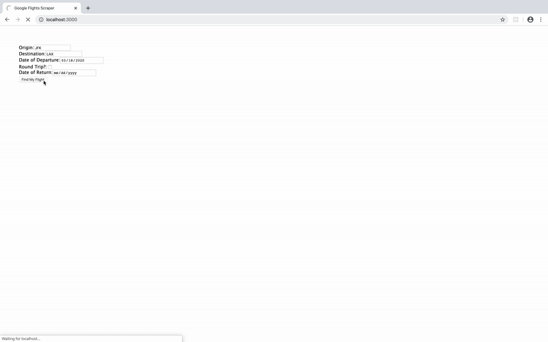

A simple scraper built in Express for Google Flights data using the Puppeteer library. The database is hosted on a remote MongoDB Atlas instance. If you need the `.env` file that contains the connection credentials, contact me personally. After you've run `yarn add` to install all the dependencies, feel free to try it out with `yarn start`. Tests written in the Jest framework are included for the controllers, models, and routing - run them with `yarn test`.



Given a query in the following format:

```
Query {
    origin: string;
    dest: string;
    departDate: string | Date;
    returnDate?: string | Date;
    isRoundTrip: boolean;
}
```

This scrapes for both a one way flights and round trip flights, storing the following information in a queryable database. Results are cached for an hour before the scraper can be run again on the same query.

* Price
* Total travel duration
* Number of stops
* Information about each stop:
  - IATA codes of origin and destination airports
  - Airline operator
  - Flight Number
  - Departure time
  - Arrival time
  - Travel duration

